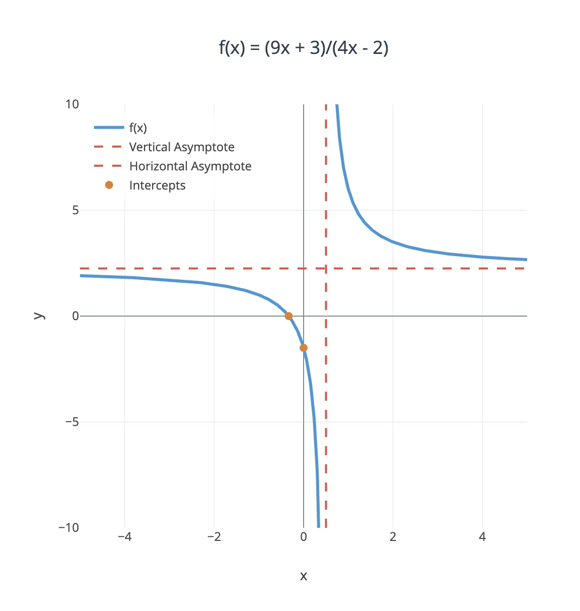

## Question 1: Translate the following sentences into propositional logic

### a) The flat is vacant.

Let V = The flat is vacant

**Answer: V**

This is a simple atomic proposition.

### b) The flat can be let only if it is vacant and has been cleaned.

Let V = The flat is vacant

Let C = The flat has been cleaned

Let L = The flat can be let

The phrase "can be let only if" is a conditional relationship. "A only if B" means, or A → B.

**Answer: L → (V ∧ C)**

### c) Don't drink and drive!

Let D = You drink

Let R = You drive

Dont do both actions simultaneously.

**Answer: ¬(D ∧ R)**

## Question 2 [6]: Translate the following sentences into predicate logic

Your formalizations should be as detailed as possible.

### a) Some teachers are strict and others are not.

Some teachers are strict

Some teachers are not strict

There exists someone who is a teacher and is strict, and there exists someone who is a teacher and is not strict.

Let Tx = x is a teacher

Let Sx = x is strict

**Answer: ∃x(Tx ∧ Sx) ∧ ∃y(Ty ∧ ¬Sy)**

### b) Some dogs' owners do not collect their dog's litter

There exists a person x and a dog y and x owns y and x does not collect y's litter.

Let Px = x is a person

Let Dx = x is a dog

Let Oxy = x owns y

Let Cxy = x collects the litter of y

**Answer: ∃x∃y(Px ∧ Dy ∧ Oxy) ∧ ¬Cxy)**

### c) All animals are equal.

For all x and y, if x is an animal and y is an animal, then x is equal to y.

Let Ax = x is an animal

Let Exy = x is equal to y

**Answer: ∀x∀y((Ax ∧ Ay) → Exy)**

## Question 3 [6]: Consider the following formula of propositional logic

**P = ((A ∨ B) ∧ C → (A ∧ B) ∨ C)**

### a) Assume that A is true, and B,C are false. Is P true or false? Briefly explain why.

Given: A = T, B = F, C = F

Substitute the values in

A ∨ B = T ∨ F = T

(A ∨ B) ∧ C = T ∧ F = F (This would already be enough...)

A ∧ B = T ∧ F = F

(A ∧ B) ∨ C = F ∨ F = F

P = ((A ∨ B) ∧ C) → ((A ∧ B) ∨ C) = F → F = T

**P is true.**

This is because a conditional statement (→) is true whenever the antecedent is false, regardless of the truth value of the consequent.

### b) Which truth values for A,B,C will result in P being false?

For P to be false, we need the antecedent ((A ∨ B) ∧ C) to be true and the consequent ((A ∧ B) ∨ C) to be false.

For the antecedent to be true:

(A ∨ B) must be true, so at least one of A or B must be true and C must be true

For the consequent to be false:

(A ∧ B) must be false, so at least one of A or B must be false and C must be false

This is a contracdiction
Therefore, **P is always true** and there are no values that make P false.

## Question 4 [8]: Predicate Logic Analysis

Consider the sentence "There is a passenger on a coach such that, if that passenger reads, then all passengers on the coach read". In predicate logic, the formula Q formalises it, where Q = ∃x(Rx → ∀yRy). Answer these questions, giving some explanations.

**a) Suppose that the coach has just two passengers. When is Q true and when is it false?**

**b) Suppose that we know that there is at least one passenger on the coach, but we do not know how many, nor how many are reading. Can we know whether Q is true or false?**

### Part a) Coach with exactly two passengers

Let's assume the two passengers are a and b. The formula Q = ∃x(Rx → ∀yRy) means "there exists a passenger x such that if x reads, then all passengers read."

For two passengers, this becomes: Q = (Ra → ∀yRy) ∨ (Rb → ∀yRy)

Since ∀yRy with two passengers means (Ra ∧ Rb), we get: Q = (Ra → (Ra ∧ Rb)) ∨ (Rb → (Ra ∧ Rb))

**Case 1: Neither reads (Ra = F, Rb = F)**

Ra → (Ra ∧ Rb) = F → F = T

Rb → (Ra ∧ Rb) = F → F = T

Q = T ∨ T = **T**

**Case 2: Only a reads (Ra = T, Rb = F)**

Ra → (Ra ∧ Rb) = T → F = F

Rb → (Ra ∧ Rb) = F → F = T

Q = F ∨ T = **T**

**Case 3: Only b reads (Ra = F, Rb = T)**

Ra → (Ra ∧ Rb) = F → F = T

Rb → (Ra ∧ Rb) = T → F = F

Q = T ∨ F = **T**

**Case 4: Both read (Ra = T, Rb = T)**

Ra → (Ra ∧ Rb) = T → T = T

Rb → (Ra ∧ Rb) = T → T = T

Q = T ∨ T = **T**

**Q is always true** when there are exactly two passengers.

### Part b) At least one passenger, unknown number and reading status

We can determine that **Q is always true**, regardless of how many passengers there are or who is reading.

There are only two possibilities:

**Case 1: All passengers read**
If ∀yRy is true, then for any passenger x, the conditional Rx → ∀yRy is true (since the consequent is true). Therefore, ∃x(Rx → ∀yRy) is true.

**Case 2: Not all passengers read**
If ∀yRy is false, then there exists at least one passenger who doesn't read. Let's call such a passenger c, where Rc = F. Then the conditional Rc → ∀yRy = F → F = T. Since we found a passenger c for whom the conditional is true, ∃x(Rx → ∀yRy) is true.

## Question 5 [12]: Binary Relations Analysis

Consider the binary relations provided below, and analyse them for these features: are they reflexive? Symmetric? Transitive? Are they equivalence relations? And if so, which are the equivalence classes? Clearly list which properties hold and which ones do not, in each relation. Give a short justification when you think that some property does not hold.

**a) R₁ = {(m, n) | m ≥ n + 2} ⊆ $\mathbb{N}$ × $\mathbb{N}$**

**b) R₂ = {(m, n) | m + n is odd } ⊆ $\mathbb{Z}$ × $\mathbb{Z}$**

**c) S = {0, 1, 2, 3, 4}, R₃ = {(0, 0), (0, 1), (1, 0), (1, 1), (2, 2), (3, 3), (4, 4), (3, 4), (4, 3)} ⊆ S × S**

**d) S = {0, 1, 2, 3, 4}, R₄ = {(0, 0), (1, 1), (2, 2), (3, 3), (4, 4)} ⊆ S × S**

### Part a) R₁ = {(m, n) | m ≥ n + 2} ⊆ $\mathbb{N}$ × $\mathbb{N}$

**Reflexive?** NO  
For reflexivity, we need (m, m) ∈ R₁ for all m ∈ $\mathbb{N}$. This requires m ≥ m + 2, which simplifies to 0 ≥ 2, which is false. So R₁ is not reflexive.

**Symmetric?** NO  
For symmetry, if (m, n) ∈ R₁, then (n, m) ∈ R₁. Consider (3, 1) ∈ R₁ since 3 ≥ 1 + 2 = 3. But (1, 3) ∉ R₁ since 1 $\ngeq$ 3 + 2 = 5. So R₁ is not symmetric.

**Transitive?** YES  
If (m, n) ∈ R₁ and (n, p) ∈ R₁, then m ≥ n + 2 and n ≥ p + 2. From the second inequality: n ≥ p + 2, so n + 2 ≥ p + 4. From the first: m ≥ n + 2 ≥ p + 4 > p + 2. Therefore (m, p) ∈ R₁, so R₁ is transitive.

**Equivalence relation?** NO (lacks reflexivity and symmetry)

### Part b) R₂ = {(m, n) | m + n is odd} ⊆ $\mathbb{Z}$ × $\mathbb{Z}$

**Reflexive?** NO  
For (m, m) ∈ R₂, we need m + m = 2m to be odd. But 2m is always even.
So R₂ is not reflexive.

**Symmetric?** YES  
If (m, n) ∈ R₂, then m + n is odd. Since n + m = m + n, we have n + m is also odd. Therefore (n, m) ∈ R₂, so R₂ is symmetric.

**Transitive?** NO  
(1, 2) ∈ R₂ since 1 + 2 = 3 is odd.
And (2, 3) ∈ R₂ since 2 + 3 = 5 is odd.

But (1, 3) ∉ R₂ since 1 + 3 = 4 is even. So R₂ is not transitive.

**Equivalence relation?** NO (lacks reflexivity and transitivity)

### Part c) S = {0, 1, 2, 3, 4}, R₃ = {(0,0), (0,1), (1,0), (1,1), (2,2), (3,3), (4,4), (3,4), (4,3)}

**Reflexive?** YES  
All pairs (0,0), (1,1), (2,2), (3,3), (4,4) are in R₃. So R₃ is reflexive.

**Symmetric?** YES  
For every (a,b) ∈ R₃, we also have (b,a) ∈ R₃:

**Transitive?** YES  
Checking all possible chains:
- From {0,1}: (0,0), (0,1), (1,0), (1,1) - all required pairs present
- From {2}: only (2,2) - trivially transitive
- From {3,4}: (3,3), (3,4), (4,3), (4,4) - all required pairs present

**Equivalence relation?** YES

**Equivalence classes:**

[0] = {0, 1} (elements related to 0)

[1] = {0, 1} (same as [0])

[2] = {2}

[3] = {3, 4}

[4] = {3, 4} (same as [3])

The distinct equivalence classes are: **{0,1}, {2}, {3,4}**

### Part d) S = {0, 1, 2, 3, 4}, R₄ = {(0,0), (1,1), (2,2), (3,3), (4,4)}

**Reflexive?** YES  
All pairs (i,i) for i ∈ S are in R₄.

**Symmetric?** YES  
All pairs in R₄ are of the form (i,i), so symmetric.

**Transitive?** YES  
For any (a,b), (b,c) ∈ R₄, we must have a = b and b = c (since all pairs are diagonal). Therefore a = c, so (a,c) ∈ R₄.

**Equivalence relation?** YES

**Equivalence classes:**  
Since R₄ is the identity relation, each element is only related to itself.

[0] = {0}

[1] = {1}

[2] = {2}

[3] = {3}

[4] = {4}

The equivalence classes are: **{0}, {1}, {2}, {3}, {4}**

## Question 6 [8]: Function Analysis

Let f : $\mathbb{R}$ → $\mathbb{R}$ be the function defined as f(x) = (9x + 3)/(4x - 2)

**a) Is f injective? Is it surjective? Justify your reasoning.**

**b) Find a formula that represents the graph of its inverse function**

---

### Part a) Injectivity and Surjectivity

**Injectivity (One-to-one):** A function is injective if f(x₁) = f(x₂) implies x₁ = x₂.

Assume f(x₁) = f(x₂):
(9x₁ + 3)/(4x₁ - 2) = (9x₂ + 3)/(4x₂ - 2)

Cross-multiplying:
(9x₁ + 3)(4x₂ - 2) = (9x₂ + 3)(4x₁ - 2)

Expanding:
36x₁x₂ - 18x₁ + 12x₂ - 6 = 36x₁x₂ - 18x₂ + 12x₁ - 6

Simplifying:

-18x₁ + 12x₂ = -18x₂ + 12x₁

-18x₁ - 12x₁ = -18x₂ - 12x₂

-30x₁ = -30x₂

x₁ = x₂

Therefore, **f is injective**.

**Surjectivity (Onto):** A function is surjective if for every y ∈ $\mathbb{R}$, there exists an x ∈ $\mathbb{R}$ such that f(x) = y.

For any y ∈ $\mathbb{R}$, we need to solve:
y = (9x + 3)/(4x - 2)

Cross-multiplying:

y(4x - 2) = 9x + 3

4xy - 2y = 9x + 3

4xy - 9x = 2y + 3

x(4y - 9) = 2y + 3

If 4y - 9 ≠ 0 (i.e., y ≠ 9/4), then:
x = (2y + 3)/(4y - 9)

However, when y = 9/4, we get:
x(0) = 2(9/4) + 3 = 9/2 + 3 = 15/2

This gives 0 = 15/2, which is impossible.

Therefore, y = 9/4 cannot be achieved by f(x) for any real x.

**f is not surjective** because 9/4 is not in the range of f.

### Part b) Inverse Function

Since f is injective but not surjective, f has an inverse function on its range (which is $\mathbb{R}$ \ {9/4}).

To find f⁻¹, solve y = f(x) for x:

y = (9x + 3)/(4x - 2)

y(4x - 2) = 9x + 3

4xy - 2y = 9x + 3

4xy - 9x = 2y + 3

x(4y - 9) = 2y + 3

x = (2y + 3)/(4y - 9)

Therefore, **f⁻¹(x) = (2x + 3)/(4x - 9)** with domain $\mathbb{R}$ \ {9/4}.

Its normally easier to see from the graph - problems are only occuring at the asymptotes

The function has a vertical asymptote at x = 1/2 (where it's undefined)

The function has a horizontal asymptote at y = 9/4 

The function is continuous everywhere in its domain (all real numbers except x = 1/2)

The horizontal line test shows the function is one-to-one (injective)

## Question 7 [16]: Calculus Functions Analysis

Answer the questions for the functions f, g, h : $\mathbb{R}$ → $\mathbb{R}$ defined below; show some working before the final answer.

**a) Find f′, for f(x) = cos(2x³ + 2x² + 3).**

**b) Find g′′, for g(x) = 4x³ − 3x² + 2x, and calculate g′′(3).**

**c) Is the function h(x) = (4+2x)/(x³+1) continuous? Is it derivable in all points in $\mathbb{R}$? Justify your reasoning.**

**d) Consider again h(x) = (4+2x)/(x³+1), but defined as h : $\mathbb{R}$⁺ → $\mathbb{R}$. Is it continuous? Is this the same function as hₐ(x) = (4+2x)/|x³+1|? Justify your reasoning.**

---

### Part a) Find f′, for f(x) = cos(2x³ + 2x² + 3)

Using the chain rule: if f(x) = cos(u) where u = 2x³ + 2x² + 3, then f′(x) = -sin(u) · u′

First, find u′:
u = 2x³ + 2x² + 3

u′ = 6x² + 4x

Therefore:
**f′(x) = -sin(2x³ + 2x² + 3) · (6x² + 4x)**

**f′(x) = -(6x² + 4x)sin(2x³ + 2x² + 3)**

### Part b) Find g′′ for g(x) = 4x³ - 3x² + 2x, and calculate g′′(3)

First, find g′(x):

g(x) = 4x³ - 3x² + 2x

g′(x) = 12x² - 6x + 2

**g′′(x) = 24x - 6**

Now calculate g′′(3):

**g′′(3) = 24(3) - 6 = 72 - 6 = 66**

### Part c) Is h(x) = (4 + 2x)/(x³ + 1) continuous? Is it derivable at all points in $\mathbb{R}$?

For continuity and differentiability, we need to check where the function might have problems.

**Potential problems:** The denominator x³ + 1 = 0
Solving: x³ = -1, so x = -1

**Continuity:**

The numerator 4 + 2x is continuous everywhere (polynomial)

The denominator x³ + 1 is continuous everywhere (polynomial)

A rational function is continuous everywhere except where the denominator equals zero

At x = -1: the denominator is 0 but the numerator is 4 + 2(-1) = 2 ≠ 0, so we have a vertical asymptote.

**Conclusion:** h(x) is continuous for all x ∈ $\mathbb{R}$ except x = -1.

**Differentiability:** h(x) is differentiable for all x ∈ $\mathbb{R}$ except x = -1.

### Part d) Consider h(x) = (4 + 2x)/(x³ + 1) defined as h : $\mathbb{R}$⁺ → $\mathbb{R}$. Is it continuous? Is this the same as hₐ(x) = (4 + 2x)/|x³ + 1|?

**With domain $\mathbb{R}$⁺ (positive real numbers):** Since the domain is now $\mathbb{R}$⁺ = (0, +∞), we exclude x = -1 from consideration.

This is continuous and differentiable for all values as -1 is excluded.

**Comparison with hₐ(x) = (4 + 2x)/|x³ + 1|:**

This is still a problem as |x³ + 1| is still 0 at x = -1.
So these functions are not the same due to the minus numbers being available.

## Question 8 [12]: Matrix Operations Analysis

We define the following matrices:

$$A = \begin{pmatrix} 2 & 1 & -2 \\ 0 & 5 & 1 \\ -3 & -1 & 0 \end{pmatrix}$$

$$B = \begin{pmatrix} 3 & -1 \\ 2 & 3 \\ -5 & 1 \end{pmatrix}$$

$$C = \begin{pmatrix} -3 & -2 & -4 \\ 3 & 1 & 0 \end{pmatrix}$$

Answer these questions, showing some working to justify your approach to the answer.

---

## Part a): Matrix Products D = ABC and E = CB

### Does D = ABC exist?

For matrix multiplication to be valid, the number of columns in the first matrix must equal the number of rows in the second matrix.

**Step 1: Check AB**
A is 3×3, B is 3×2

Since A has 3 columns and B has 3 rows, AB exists and will be 3×2

**Step 2: Check (AB)C**
AB is 3×2, C is 2×3

Since AB has 2 columns and C has 2 rows, (AB)C exists and will be 3×3

**Therefore, D = ABC exists and is a 3×3 matrix.**

### Does E = CB exist?

**Check CB:**
C is 2×3, B is 3×2

Since C has 3 columns and B has 3 rows, CB exists and will be 2×2

**Therefore, E = CB exists and is a 2×2 matrix.**

### Calculate d₂₃ (element in row 2, column 3 of D)

First, calculate AB:

$$AB = \begin{pmatrix} 2 & 1 & -2 \\ 0 & 5 & 1 \\ -3 & -1 & 0 \end{pmatrix} \begin{pmatrix} 3 & -1 \\ 2 & 3 \\ -5 & 1 \end{pmatrix}$$

$$= \begin{pmatrix} 18 & -1 \\ 5 & 16 \\ -11 & 0 \end{pmatrix}$$

Now calculate D = (AB)C:

$$D = \begin{pmatrix} 18 & -1 \\ 5 & 16 \\ -11 & 0 \end{pmatrix} \begin{pmatrix} -3 & -2 & -4 \\ 3 & 1 & 0 \end{pmatrix}$$

$$= \begin{pmatrix} -57 & -37 & -72 \\ 33 & 6 & -20 \\ 33 & 22 & 44 \end{pmatrix}$$

**d₂₃ = -20**

### Calculate e₂₁ (element in row 2, column 1 of E)

Calculate E = CB:

$$E = \begin{pmatrix} -3 & -2 & -4 \\ 3 & 1 & 0 \end{pmatrix} \begin{pmatrix} 3 & -1 \\ 2 & 3 \\ -5 & 1 \end{pmatrix}$$

$$= \begin{pmatrix} 7 & -7 \\ 11 & 0 \end{pmatrix}$$

**e₂₁ = 11**

## part b): Matrix F = B + Cᵀ

### Does F = B + Cᵀ exist?

For matrix addition, both matrices must have the same dimensions.

**Check dimensions:**
B is 3×2
C is 2×3, so Cᵀ is 3×2

Since both B and Cᵀ are 3×2, **F = B + Cᵀ exists.**

### Calculate F

First, find Cᵀ:

$$C^T = \begin{pmatrix} -3 & 3 \\ -2 & 1 \\ -4 & 0 \end{pmatrix}$$

Now calculate F = B + Cᵀ:

$$F = \begin{pmatrix} 3 & -1 \\ 2 & 3 \\ -5 & 1 \end{pmatrix} + \begin{pmatrix} -3 & 3 \\ -2 & 1 \\ -4 & 0 \end{pmatrix} = \begin{pmatrix} 0 & 2 \\ 0 & 4 \\ -9 & 1 \end{pmatrix}$$

## part c): Linear Independence and Transpose

### What does it mean for columns of a square matrix M to be linearly independent?

The columns of a square matrix M are **linearly independent** if the only solution to the equation:

$$c_1\vec{v_1} + c_2\vec{v_2} + \cdots + c_n\vec{v_n} = \vec{0}$$

where $\vec{v_1}, \vec{v_2}, \ldots, \vec{v_n}$ are the column vectors of M and $c_1, c_2, \ldots, c_n$ are scalars, is the trivial solution $c_1 = c_2 = \cdots = c_n = 0$.

Or the columns are linearly independent if and only if the matrix M is invertible or $\det(M) \neq 0$.

### Will Mᵀ also have linearly independent columns?

**Yes, if M has linearly independent columns, then Mᵀ will also have linearly independent columns.**

**Reasoning:**
The columns of M are linearly independent ⟺ M is invertible ⟺ $\det(M) \neq 0$
For any square matrix M: $\det(M^T) = \det(M)$
Therefore: $\det(M) \neq 0$ ⟺ $\det(M^T) \neq 0$ ⟺ $M^T$ is invertible ⟺ columns of $M^T$ are linearly independent

### Effects on determinants

$$\det(M^T) = \det(M)$$

This is a fundamental property of determinants. Taking the transpose does not change the determinant value. 
Therefore, if M has linearly independent columns ($\det(M) \neq 0$), then $M^T$ will have the same determinant value and also have linearly independent columns.

## Question 9 [16]: Matrix Analysis

We define the matrix:

$$M = \begin{pmatrix} -2 & 4 \\ -1 & 3 \end{pmatrix}$$

---

## part a): Determinant, Inverse, Eigenvalues and Eigenvectors

### Calculate the determinant

For a 2×2 matrix $\begin{pmatrix} a & b \\ c & d \end{pmatrix}$, the determinant is $ad - bc$.

$$\det(M) = (-2)(3) - (4)(-1) = -6 + 4 = -2$$

### Calculate the inverse matrix

For a 2×2 matrix $\begin{pmatrix} a & b \\ c & d \end{pmatrix}$ with determinant $\Delta$, the inverse is:

$$M^{-1} = \frac{1}{\Delta} \begin{pmatrix} d & -b \\ -c & a \end{pmatrix}$$

Since $\det(M) = -2 \neq 0$, the inverse exists:

$$M^{-1} = \frac{1}{-2} \begin{pmatrix} 3 & -4 \\ 1 & -2 \end{pmatrix} = \begin{pmatrix} -\frac{3}{2} & 2 \\ -\frac{1}{2} & 1 \end{pmatrix}$$

### Calculate eigenvalues

The eigenvalues are found by solving $\det(M - \lambda I) = 0$:

$$M - \lambda I = \begin{pmatrix} -2-\lambda & 4 \\ -1 & 3-\lambda \end{pmatrix}$$

$$\det(M - \lambda I) = (-2-\lambda)(3-\lambda) - (4)(-1)$$
$$= (-2-\lambda)(3-\lambda) + 4$$
$$= -6 + 2\lambda - 3\lambda + \lambda^2 + 4$$
$$= \lambda^2 - \lambda - 2$$

Setting this equal to zero:
$$\lambda^2 - \lambda - 2 = 0$$
$$(\lambda - 2)(\lambda + 1) = 0$$

**Eigenvalues: $\lambda_1 = 2$ and $\lambda_2 = -1$**

### Calculate eigenvectors

**For $\lambda_1 = 2$:**
Solve $(M - 2I)\vec{v} = \vec{0}$:

$$\begin{pmatrix} -4 & 4 \\ -1 & 1 \end{pmatrix} \begin{pmatrix} x \\ y \end{pmatrix} = \begin{pmatrix} 0 \\ 0 \end{pmatrix}$$

This gives us: $-4x + 4y = 0$, so $x = y$.

**Eigenvector for $\lambda_1 = 2$: $\vec{v_1} = \begin{pmatrix} 1 \\ 1 \end{pmatrix}$ (or any scalar multiple)**

**For $\lambda_2 = -1$:**
Solve $(M + I)\vec{v} = \vec{0}$:

$$\begin{pmatrix} -1 & 4 \\ -1 & 4 \end{pmatrix} \begin{pmatrix} x \\ y \end{pmatrix} = \begin{pmatrix} 0 \\ 0 \end{pmatrix}$$

This gives us: $-x + 4y = 0$, so $x = 4y$.

**Eigenvector for $\lambda_2 = -1$: $\vec{v_2} = \begin{pmatrix} 4 \\ 1 \end{pmatrix}$ (or any scalar multiple)**

## part b): Geometric Effects on Point (0, -4)

### Apply the transformation

When matrix M is applied to point $(0, -4)$:

$$M \begin{pmatrix} 0 \\ -4 \end{pmatrix} = \begin{pmatrix} -2 & 4 \\ -1 & 3 \end{pmatrix} \begin{pmatrix} 0 \\ -4 \end{pmatrix} = \begin{pmatrix} (-2)(0) + (4)(-4) \\ (-1)(0) + (3)(-4) \end{pmatrix} = \begin{pmatrix} -16 \\ -12 \end{pmatrix}$$

**The point $(0, -4)$ is transformed to $(-16, -12)$.**

**Analysis of the transformation:**

The eigenvalues are $\lambda_1 = 2$ and $\lambda_2 = -1$

Along the eigenvector direction $\begin{pmatrix} 1 \\ 1 \end{pmatrix}$, vectors are scaled by factor 2

Along the eigenvector direction $\begin{pmatrix} 4 \\ 1 \end{pmatrix}$, vectors are scaled by factor -1 (reflection and scaling)

The negative eigenvalue $\lambda_2 = -1$ indicates a reflection along the direction perpendicular to $\begin{pmatrix} 4 \\ 1 \end{pmatrix}$

The transformation combines scaling and reflection. The determinant is negative (-2), confirming orientation reversal.

**For the specific point $(0, -4)$:** The point moves from the negative y-axis to the third quadrant at $(-16, -12)$, demonstrating both the scaling and orientation-reversing effects.

## part c): Information from the Determinant

For our matrix: $|\det(M)| = |-2| = 2$, so areas are doubled.

For our matrix: $\det(M) = -2 < 0$, so orientation is reversed.

For our matrix: $\det(M) = -2 \neq 0$, so the transformation is invertible.

The columns (or rows) of the matrix are linearly independent

## Question 10 [10]: System of Linear Equations

Calculate the solution to the system of real linear equations, by showing your approach:

x₁ - 2x₂ - 3x₃ = -1
x₁ + 3x₂ - 4x₃ = 0
2x₁ + 3x₂ + x₃ = 2

---

Solution using Direct Substitution - initially i used gaussian elimination - which worked well but was a pain in the 
ass for the pdf!  

The easiest approach is to solve equation 1 for x₁ and substitute.

### Solve equation 1 for x₁

From equation 1: x₁ - 2x₂ - 3x₃ = -1

**x₁ = -1 + 2x₂ + 3x₃**

### Substitute into equations 2 and 3

**Substitute into equation 2:**
x₁ + 3x₂ - 4x₃ = 0

(-1 + 2x₂ + 3x₃) + 3x₂ - 4x₃ = 0

-1 + 2x₂ + 3x₃ + 3x₂ - 4x₃ = 0

-1 + 5x₂ - x₃ = 0

**5x₂ - x₃ = 1**

**Substitute into equation 3:**
2x₁ + 3x₂ + x₃ = 2

2(-1 + 2x₂ + 3x₃) + 3x₂ + x₃ = 2

-2 + 4x₂ + 6x₃ + 3x₂ + x₃ = 2

-2 + 7x₂ + 7x₃ = 2

7x₂ + 7x₃ = 4

**x₂ + x₃ = 4/7** 

### Solve the 2×2 system

From equations from above:

5x₂ - x₃ = 1

x₂ + x₃ = 4/7

Add the equations:
6x₂ = 1 + 4/7 = 7/7 + 4/7 = 11/7

**x₂ = 11/42**

### Find x₃

From above: x₃ = 4/7 - x₂ = 4/7 - 11/42

4/7 = 24/42

x₃ = 24/42 - 11/42 = **13/42**

### Find x₁

x₁ = -1 + 2x₂ + 3x₃

x₁ = -1 + 2(11/42) + 3(13/42)

x₁ = -1 + 22/42 + 39/42

x₁ = -1 + 61/42

x₁ = -42/42 + 61/42 = **19/42**

### Final Solution

**x₁ = 19/42**
**x₂ = 11/42**
**x₃ = 13/42**

**References**: I used copilot for help with some of the latex, I used markdown in visual studio code with pandoc to convert to pdf
For instance mathbb{R} which I was unaware of. There was still a lot of fighting with latex tho...

For learning the set proofs I watched the Math sorceror videos on Udemy and for the logic i used my old "Beginning Logic" from Lemon

https://textbooks.math.gatech.edu/ila/linear-independence.html 
https://www.cuemath.com/algebra/transpose-of-a-matrix/

For set theory equivalence classes - https://www.udemy.com/course/precalculus-1/?kw=precal&src=sac&couponCode=LETSLEARNNOW

